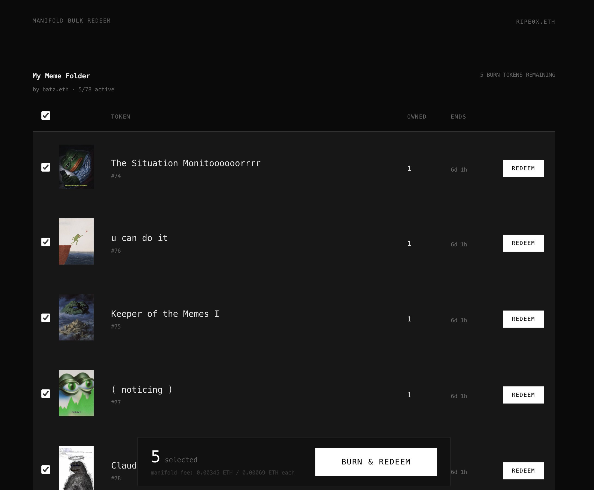

# Manifold Bulk Burn & Redeem

[](https://opensource.org/licenses/MIT)

A web application for bulk redeeming tokens from Manifold burn/redeem campaigns. Redeem multiple tokens in a single session instead of processing them one by one.

**Live at**: [burnredeem.ripe.wtf](https://burnredeem.ripe.wtf) | [Example: Batz's My Meme Folder](https://burnredeem.ripe.wtf/0xbd6a35f940Af142Ec7f093a35FAB697d98C9F9Bd/0xFc29813Beeb3c7395C7A5f8dfC3352491D5ea0E2)



## Why?

Manifold's native burn/redeem UI only allows redeeming one token at a time. If you're a collector with many tokens to redeem, this gets painfully tedious fast. This tool lets you select multiple tokens and process them in bulk from a single page, saving time and clicks.

## Features

- Connect any Web3 wallet via RainbowKit
- Discover burn/redeem campaigns for a creator contract
- Select and redeem multiple tokens in one session
- Real-time balance display and transaction tracking
- ENS resolution for creator addresses

## Supported Contracts

Currently supports **Ethereum mainnet** only. Works with Manifold's burn/redeem extension contracts:

| Type | Contract |
|------|----------|
| ERC-1155 Burn/Redeem | `0xFc29813Beeb3c7395C7A5f8dfC3352491D5ea0E2` |
| ERC-721 Burn/Redeem | `0xe5ce79AB71A5F1caC06fB3498b25298f37e43327` |

Each redemption incurs Manifold's standard fee of **0.00069 ETH**. This fee is currently hardcoded in `src/config/contracts.ts` — if Manifold changes their fee structure, you'll need to update `MANIFOLD_FEE` and `MANIFOLD_FEE_WEI` accordingly.

To add support for other chains (Base, Optimism, etc.), update the chain config in `src/config/wagmi.ts` and add the corresponding Manifold contract addresses for that chain.

**Note:** Campaign discovery scans the last ~100,000 blocks (~15 days). Older campaigns won't appear. To extend this range, adjust `fromBlock` in `src/hooks/useCampaigns.ts`.

## Prerequisites

- [Node.js](https://nodejs.org/) (v18 or higher)
- npm or yarn
- An Ethereum wallet (MetaMask, Rainbow, etc.)
- [Alchemy API key](https://www.alchemy.com/) (free tier works)
- [WalletConnect Project ID](https://cloud.walletconnect.com/) (free)

## Installation

1. Clone the repository:
   ```bash
   git clone https://github.com/ripe0x/manifold-bulk-redeem.git
   cd manifold-bulk-redeem
   ```

2. Install dependencies:
   ```bash
   npm install
   ```

3. Create a `.env` file in the root directory:
   ```bash
   VITE_ALCHEMY_API_KEY=your_alchemy_api_key
   VITE_WALLETCONNECT_PROJECT_ID=your_walletconnect_project_id
   ```

4. Start the development server:
   ```bash
   npm run dev
   ```

## Usage

1. Open the app in your browser (default: http://localhost:5173)
2. Enter the **Creator Contract** address — the Manifold creator contract (ERC-1155 or ERC-721) that mints the reward tokens
3. Enter the **Burn/Redeem Contract** address — one of Manifold's burn/redeem extension contracts listed above
4. Click "Find Redeems" to discover all burn/redeem campaigns for that creator contract
5. Connect your wallet
6. Select tokens to redeem and follow the approval/redeem flow

## Tech Stack

- [React](https://react.dev/) - UI framework
- [Vite](https://vitejs.dev/) - Build tool
- [TypeScript](https://www.typescriptlang.org/) - Type safety
- [viem](https://viem.sh/) - Ethereum interactions
- [wagmi](https://wagmi.sh/) - React hooks for Ethereum
- [RainbowKit](https://www.rainbowkit.com/) - Wallet connection

## Scripts

| Command | Description |
|---------|-------------|
| `npm run dev` | Start development server |
| `npm run build` | Build for production |
| `npm run preview` | Preview production build |

## Fork & Deploy

Feel free to fork this repo and deploy your own instance. Just add your own Alchemy and WalletConnect credentials.

## License

This project is licensed under the MIT License - see the [LICENSE](LICENSE) file for details.

## Author

Built by [ripe](https://github.com/ripe0x) ([@ripe0x](https://x.com/ripe0x))
